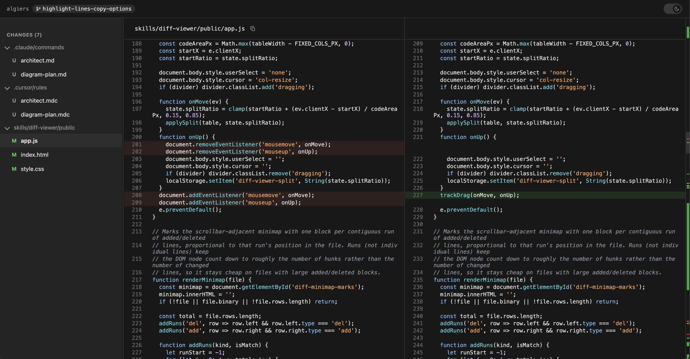

# Skills

Small, composable skills for coding agents — Claude Code, Conductor, Cursor, and Codex.

### Quick install

```bash
node scripts/install.js
```

See the [full install docs below](#install).

## Skills At A Glance

- [`/diagram-plan`](#diagram-plan) - Turn a plan into Mermaid diagrams.
- [`/architect`](#architect) - Keep architecture and data-flow diagrams synced with the codebase.
- [`/diff-viewer`](#diff-viewer) - Review uncommitted changes side-by-side in a local browser UI.
- [`/e2e`](#e2e) - Deliver a feature end-to-end: design, review, plan, implement, test, review.

## Skill Details

### [`/diagram-plan`](skills/diagram-plan/SKILL.md)

Turns a plan into Mermaid diagrams. Pass a plan as inline text or a file path; outputs whichever diagram types are actually useful (flowchart, sequence, ER, state), each with a one-sentence explanation.

Solves for plans that are hard to picture in prose — a diagram makes the shape of a change obvious before any code gets written. No implementation, no extra prose — just the diagrams.

### [`/architect`](skills/architect/SKILL.md)

Scans the codebase and keeps system architecture and data-flow diagrams synchronized with the code. Writes them into a dedicated section at the bottom of `README.md` using `<!-- architecture-start -->` / `<!-- architecture-end -->` markers.

Solves for architecture docs that drift from reality — re-running updates the diagrams in place instead of leaving stale ones behind.

### [`/diff-viewer`](skills/diff-viewer/SKILL.md)

Starts a local, zero-dependency web server showing uncommitted changes side-by-side — old on the left, new on the right, red/green highlights, light/dark toggle. The sidebar is a collapsible directory tree (like GitHub's PR view) split into Staged Changes and Changes sections, like an IDE's source control panel.

Solves for reviewing your own diffs somewhere roomier than a terminal. Opens automatically in your default browser, binds to `127.0.0.1` only, and only ever runs one instance per repo — launching it again replaces the previous instance instead of stacking up background processes.

<picture>
  
</picture>

*Side-by-side diff with a collapsible file-tree sidebar, split into Staged and Changes sections.*

### [`/e2e`](skills/e2e/SKILL.md)

Takes requirements through the full delivery cycle: writes a design doc, sends it to parallel subagents for review, triages their feedback, writes a finalized plan (invoking `/diagram-plan` for diagrams), implements it, adds a conservative set of E2E/integration tests around the happy path and key failure points, then runs a final review (`/code-review` if available, otherwise a simple review subagent).

Solves for non-trivial features that deserve real design review before code gets written — not a fit for quick fixes.

---

## Install

### Prerequisites
Node.js 18+

### Install all skills

**User-wide (all projects):**
```bash
node scripts/install.js
```

**Current project only:**
```bash
node scripts/install.js --project
```

### Install a single skill
```bash
node scripts/install.js diagram-plan
node scripts/install.js architect --project
```

### Target a specific agent

```bash
# Claude Code (default)
node scripts/install.js --target claude

# Conductor (same as Claude Code — Conductor runs Claude Code)
node scripts/install.js --target conductor

# Cursor
node scripts/install.js --target cursor

```

Flags can be combined:
```bash
node scripts/install.js architect --target cursor --project
```

### Updating

Re-run the same install command. Files that haven't changed are skipped; changed ones are overwritten. No manual cleanup needed.

### Usage per agent

| Agent | How to invoke |
|---|---|
| Claude Code | `/diagram-plan`, `/architect`, `/diff-viewer`, `/e2e` |
| Conductor | `/diagram-plan`, `/architect`, `/diff-viewer`, `/e2e` |
| Cursor | Type `@diagram-plan`, `@architect`, `@diff-viewer`, or `@e2e` in chat |

---

## Adding a skill

1. Create `skills/<name>/SKILL.md`
2. Add frontmatter with `description` and `allowed-tools` (Claude Code syntax — the installer transforms it per target)
3. Write the instructions in the body
4. Run `node scripts/install.js`

### SKILL.md template

```markdown
---
description: One-line description of what this skill does
allowed-tools: Read, Bash(find:*), Bash(grep:*)
---

Instructions for Claude to follow when this skill is invoked...
```

---

## How it works

Skills are plain markdown files. The installer copies them to the right location for each agent, transforming agent-specific frontmatter as needed:

| Target | Install location | Format |
|---|---|---|
| `claude` | `~/.claude/commands/` or `.claude/commands/` | `.md` with Claude frontmatter |
| `conductor` | `~/.claude/commands/` or `.claude/commands/` | `.md` with Claude frontmatter |
| `cursor` | `~/.cursor/rules/` or `.cursor/rules/` | `.mdc` with Cursor frontmatter |

No servers to start. No config to edit manually. The skill content is agent-agnostic — only the delivery format changes.

**Note:** `diff-viewer` bundles a `server.js` and `public/` assets alongside its `SKILL.md`. The installer above only copies `SKILL.md` into the flat `commands`/`rules` directories, so those bundled files won't be carried over by `node scripts/install.js`. For now, run `/diff-viewer` from within this repo (e.g. via the `.claude-plugin` plugin, which references `skills/diff-viewer/SKILL.md` directly), or install it manually by copying the whole `skills/diff-viewer/` folder into `.claude/skills/diff-viewer/`.
